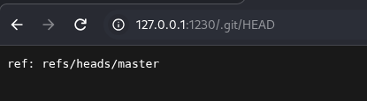
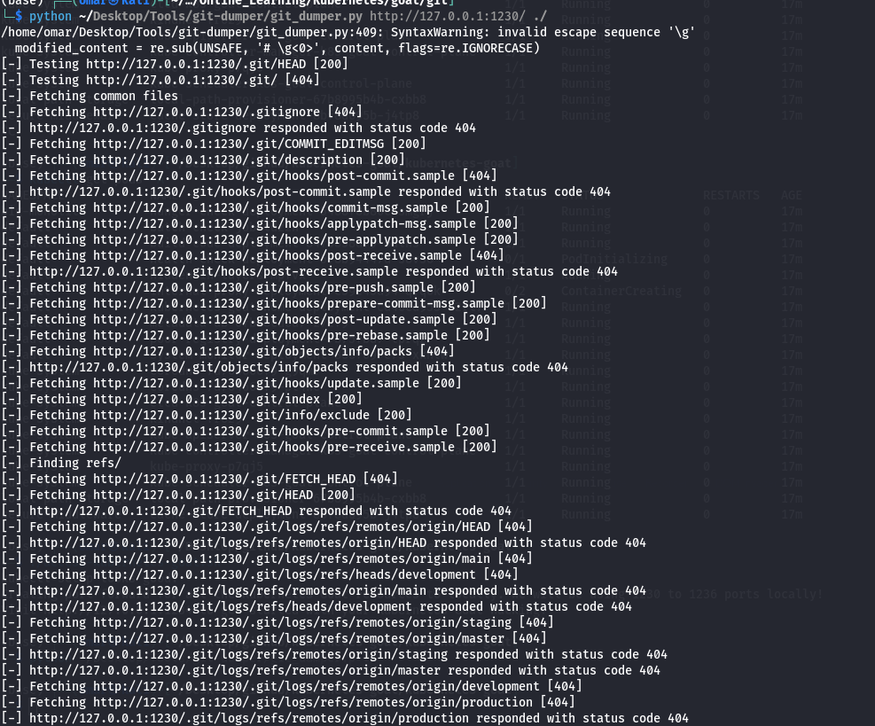
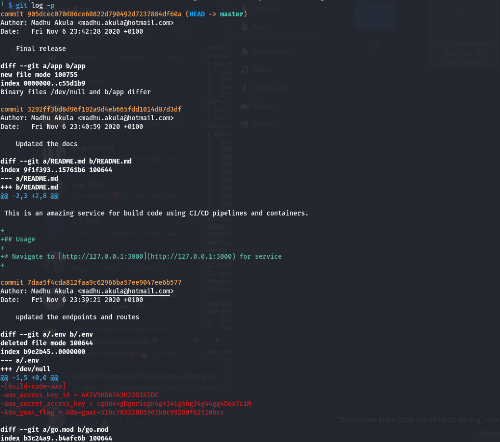

## Exposed .git Directory

this website is Vulnerable to an **Exposed `.git` Directory** attack 

Navigating directly to `/.git/HEAD` returns `ref: refs/heads/master`, confirming that the web server is serving the repository's internal `.git` folder publicly instead of blocking access to it.

---

## Dumping the Repository

we use **git-dumper** to reconstruct the full repository from the exposed `.git` directory

```
python ~/Desktop/Tools/git-dumper/git_dumper.py http://127.0.0.1:1230/ ./
```

git-dumper iterates through common Git internal paths (`HEAD`, `index`, `logs/`, `objects/`, `hooks/`, etc.), fetching every file it can reach and rebuilding the repository's object store locally.



---

## Extracting Sensitive Data

Once the repository is rebuilt, `git log -p` can be used to walk the **full commit history** — including commits that deleted files, since the deleted content still exists as a blob in `.git/objects`

```
git log -p
```

An older commit shows a `.env` file that was later deleted from the repo (`commit 7daa5f4...`, "updated the endpoints and routes"). Because the file was only deleted from the working tree and not purged from Git's history, the diff still reveals the plaintext secrets it once contained:



- AWS access key ID (`aws_access_key_id`)
- AWS secret access key (`aws_secret_access_key`)
- An internal flag/token (`k8s-goat-flag`)

This demonstrates that **deleting a secret from a tracked file does not remove it from version control** — it remains retrievable by anyone who can read the `.git` history.

---

## Remediation

### 1. Prevent `.git` Exposure

- **Block Access at the Web Server:**
    - Deny all external requests to `.git` (and other VCS directories) at the reverse proxy / web server level, e.g. in Nginx:
        
        ```
        location ~ /\.git {    deny all;    return 404;}
        ```
        
- **Never Deploy the Repository Root as the Web Root:**
    - Deploy only the built/compiled artifacts to the serving directory; never point the webroot at a checked-out Git repository.
- **CI/CD Hardening:**
    - Exclude `.git` from container images and deployment bundles (`.dockerignore`, build pipeline rules).

### 2. Eliminate Hardcoded Secrets

- **Purge Secrets From History:**
    - Treat any committed secret as compromised. Rotate/revoke it immediately, then rewrite history with `git filter-repo` (or BFG Repo-Cleaner) to strip the blob, and force-push.
- **Never Commit `.env` / Credential Files:**
    - Add `.env`, `*.pem`, and similar files to `.gitignore` from the start of the project.
- **Use a Secrets Manager:**
    - Store credentials in a dedicated secrets manager (AWS Secrets Manager, HashiCorp Vault, Kubernetes Secrets) and inject them at runtime instead of hardcoding them in source.
- **Automated Secret Scanning:**
    - Add pre-commit hooks and CI scanning (`gitleaks`, `trufflehog`) to catch secrets before they're ever pushed.

### 3. Least Privilege for Leaked Credentials

- **Scope IAM Keys Tightly:**
    - If AWS keys must exist, scope them to the minimum required permissions so a leak has limited blast radius.
- **Enable Key Usage Alerts:**
    - Use AWS CloudTrail / GuardDuty to alert on unexpected use of access keys from unfamiliar IPs or regions.