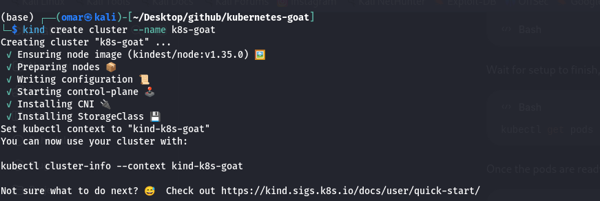
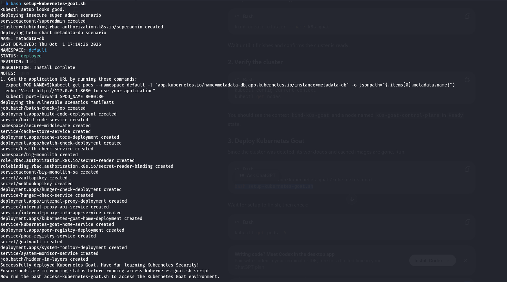
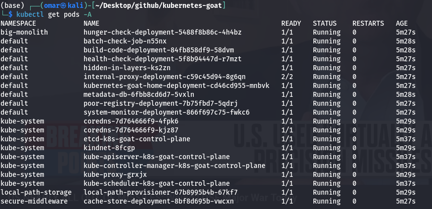
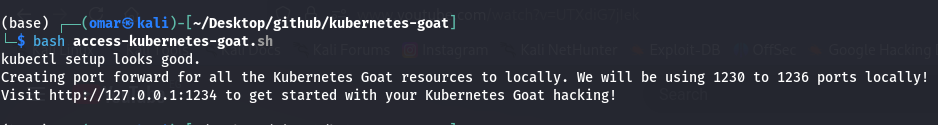
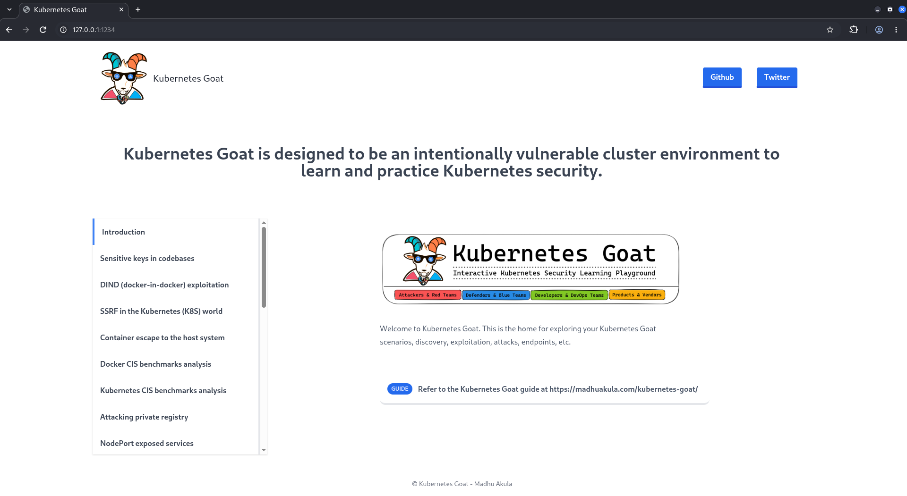

## Create Cluster

```kind create cluster --name k8s-goat```



## Run setup Script

```bash setup-kubernetes-goat.sh```



## Ensure All pods running

```kubectl get pods -A ```



## Run access script

```bash access-kubernetes-goat.sh```



## Start Hacking

