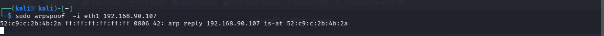
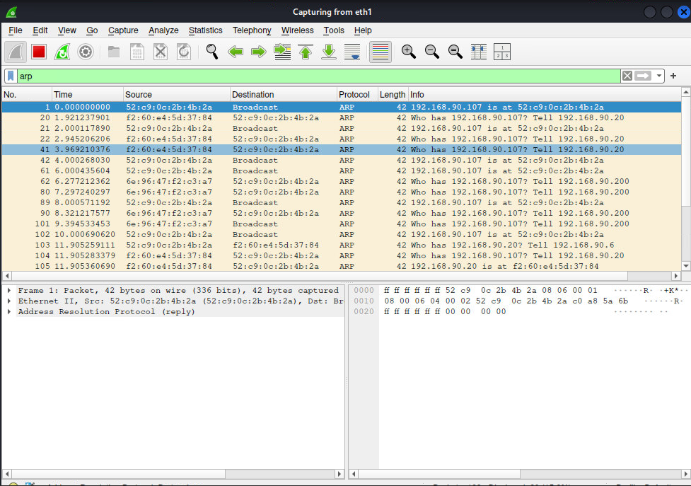
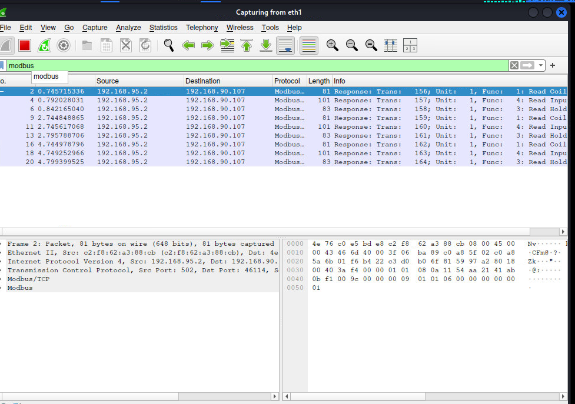
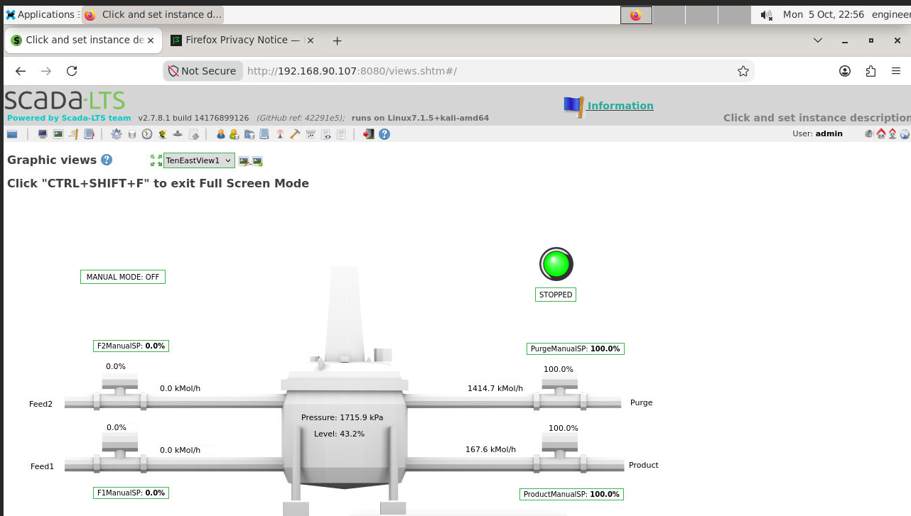
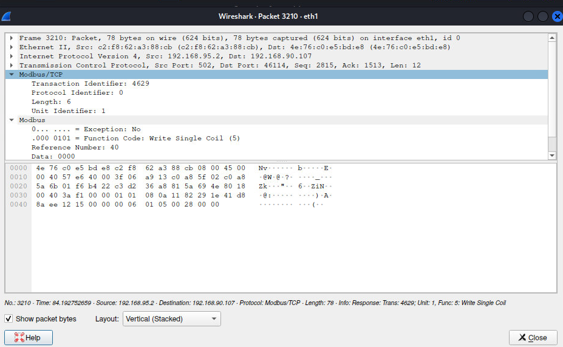
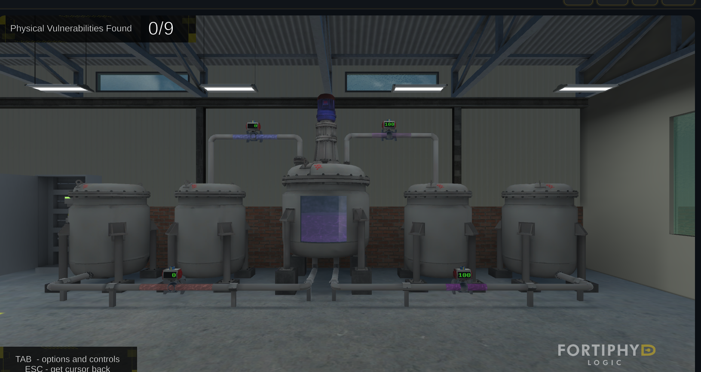

# ARP Spoofing and Packet Sniffing

## 1. Launching the ARP Spoofing Attack

To position ourselves as a man-in-the-middle (MITM) between the victim host (`192.168.90.107`) and the gateway/router, we used `arpspoof` to poison the victim's ARP cache.


*Figure 1: `arpspoof` launched from Kali on interface `eth1`, targeting `192.168.90.107`.*

```bash
sudo arpspoof -i eth1 192.168.90.107
```

**Output:**
```
52:c9:c0:2b:4b:2a ff:ff:ff:ff:ff:ff 0806 42: arp reply 192.168.90.107 is-at 52:c9:c0:2b:4b:2a
```

This continuously broadcasts forged ARP replies, telling the network that `192.168.90.107`'s IP now resolves to our attacker-controlled MAC address (`52:c9:0c:2b:4b:2a`), re-routing the victim's traffic through our Kali machine.

---

## 2. Verifying the Poisoning in Wireshark

Capturing on `eth1`, we filtered on `arp` to confirm the spoofed replies were being broadcast and accepted by hosts on the segment.


*Figure 2: Wireshark ARP capture confirming repeated spoofed replies.*

**Key observations:**
- Our attacker MAC (`52:c9:0c:2b:4b:2a`) is repeatedly announced as the owner of `192.168.90.107`, both as unsolicited broadcast replies and in response to genuine ARP requests from `192.168.90.20` and `192.168.90.200`.
- Legitimate ARP traffic (e.g. `f2:60:e4:5d:37:84` and `6e:96:47:f2:c3:a7` asking "Who has 192.168.90.107?") is visible interleaved with our spoofed replies, showing the attack actively racing/overriding legitimate ARP resolution.
- This confirms the ARP cache poisoning is successful — traffic destined for `192.168.90.107` from other hosts on the `192.168.90.X` segment will now be sent to our attacker MAC instead.

With the MITM position established, we are now able to transparently intercept, inspect, and manipulate traffic between the victim host and the rest of the network — including Modbus/TCP traffic destined for the ICS segment (`192.168.95.X`).

---

## 3. Sniffing Modbus Traffic Through the MITM Position

With traffic now flowing through our attacker machine, we filtered the live capture on `modbus` to isolate ICS protocol traffic traversing the poisoned link.


*Figure 3: Wireshark `modbus` filter showing intercepted Modbus/TCP responses between `192.168.95.2` (PLC/Modbus server) and `192.168.90.107` (HMI/engineering workstation).*

**Key observations:**
- Traffic is flowing between `192.168.95.2:502` (the Modbus server) and `192.168.90.107` (the SCADA-LTS HMI host), confirming our MITM position sits directly on the HMI-to-PLC communication path.
- Multiple Modbus function codes are visible in the polling traffic: **Read Coil (1)**, **Read Input (4)**, and **Read Holding (3)** — typical of an HMI continuously polling live process values (tank level, pressure, valve positions, flow rates).
- The full capture was saved for offline analysis: [`modbus.pcapng`](./modbus.pcapng)

---

## 4. Target: SCADA-LTS HMI

The victim host (`192.168.90.107`) runs **SCADA-LTS**, a web-based HMI, reachable at `http://192.168.90.107:8080/views.shtm`. It displays a live process graphic for a mixing/reactor vessel with two feed lines (Feed1, Feed2), a purge line, and a product outlet — this is the process whose Modbus traffic we are intercepting.

---

## 5. Observing a Stop Command Issued via the HMI (Blue Team Action)

While sniffing was active, the blue team interacted with the HMI and pressed the **Stop** control on the SCADA-LTS graphic view.


*Figure 4: SCADA-LTS graphic view after the Stop button was pressed — process status shows **STOPPED**, `MANUAL MODE: OFF`, feed setpoints at `0.0%`, and purge/product valves driven to `100.0%`.*

This button press on the HMI front-end translates directly into a Modbus write command sent down to the PLC/Modbus server over the network we are sitting in the middle of.

---

## 6. Capturing the Single Modbus Write Command

Because our MITM position sits on the HMI-to-PLC path, the single Modbus command generated by that button press was captured in full:


*Figure 5: Wireshark packet detail — Modbus/TCP **Write Single Coil** command, Trans: 4629, Unit: 1, Function Code 5 (Write Single Coil), Reference Number: 40, Data: `0000`, sent from `192.168.95.2` (Modbus server, acting as response/echo) to `192.168.90.107`.*

**Breakdown:**
| Field | Value |
|---|---|
| Source → Destination | `192.168.95.2` → `192.168.90.107` |
| Src Port → Dst Port | `502` → `46114` |
| Transaction ID | `4629` |
| Unit Identifier | `1` |
| Function Code | `5` — Write Single Coil |
| Reference (Coil) Address | `40` |
| Data | `0000` (coil set **OFF**) |

This confirms exactly how the HMI's "Stop" button maps to the wire protocol: a single, unauthenticated **Write Single Coil (FC 5)** request targeting coil address `40`, writing a value of `0x0000` to de-energize/disable that point. Because Modbus/TCP has no built-in authentication or integrity protection, any party on the communication path — including our MITM position — could replay, modify, or forge this exact command against the PLC.

---

## 7. Confirming Physical Impact

To validate that the captured command had a real effect on the simulated physical process (not just the HMI's displayed state), we cross-checked the 3D physical process simulation (Fortiphyd GRFICS plant view).


*Figure 6: Physical process simulation view showing the plant's valves driven to the same stopped state (`0` / `100`) reflected on the SCADA-LTS HMI — confirming the Modbus write command propagated all the way to the simulated physical equipment.*

This closes the loop between the cyber action (Modbus Write Single Coil command observed on the wire) and its real/physical-world consequence (valve positions changed on the simulated plant), which is the core risk ARP spoofing + Modbus MITM poses in an OT environment: an attacker in this position does not just read process data, they can alter and inject control commands that physically affect the process.

---

## Summary

| Step | Action | Tool / Evidence |
|---|---|---|
| 1 | Poisoned victim's ARP cache | `arpspoof -i eth1 192.168.90.107` (`spoof.png`) |
| 2 | Verified spoofed ARP replies on the wire | Wireshark `arp` filter (`Arp.png`) |
| 3 | Sniffed Modbus/TCP traffic through the MITM position | Wireshark `modbus` filter (`modbus.png`, `modbus.pcapng`) |
| 4 | Observed blue team issue a Stop command via the HMI | SCADA-LTS web interface (`Stoppingusingbutton.png`) |
| 5 | Captured the exact Modbus command generated | Write Single Coil, FC 5, Coil 40 → `0000` (`writesinglecommand.png`) |
| 6 | Confirmed physical-world effect of the command | GRFICS physical plant view (`stoppedGUI.png`) |
