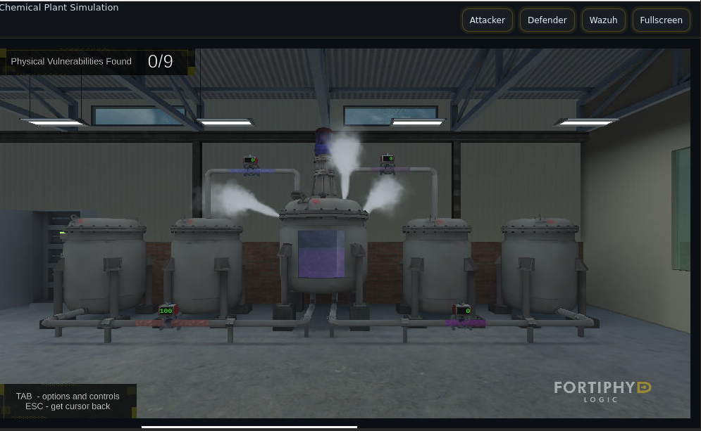
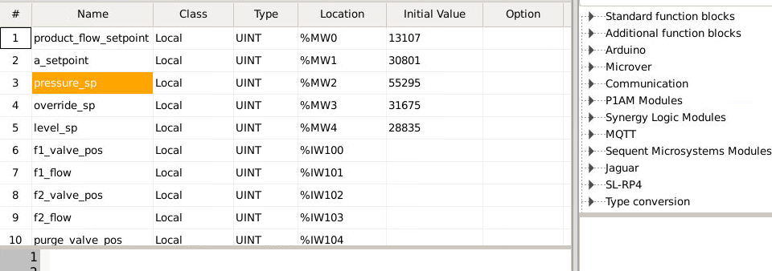
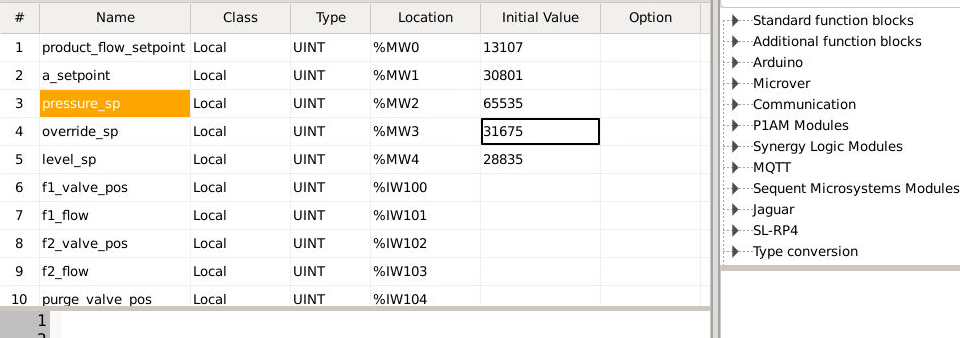
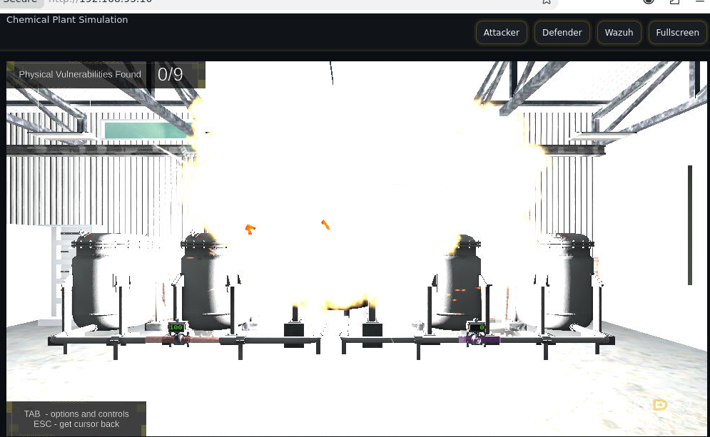

# PLC Attack — Weaponizing `pressure_sp` via OpenPLC

## 1. Scenario: Workstation with Full PLC Access

To simulate an attacker who has already pivoted to (or compromised) an engineering workstation with full access to the control network, we used that workstation to directly reach the **OpenPLC** web runtime managing the chemical plant simulation, at:

```
http://192.168.95.2:8080
```

OpenPLC exposes a web UI for uploading compiled IEC 61131-3 Structured Text (`.st`) programs directly to the PLC runtime, with no additional change-control, signing, or integrity checking beyond the operator's login. An attacker with workstation-level access to this interface can therefore push a **modified control program straight to the PLC**, overwriting the legitimate logic in a single upload.


*Figure 1: The chemical plant simulation (Fortiphyd GRFICS) under normal operation — vessel venting visible via the purge line, consistent with the relief/purge control loop actively regulating pressure.*

---

## 2. The Legitimate Logic (`chemical.st`)

The baseline control program, `chemical.st`, defines the process variable `pressure_sp` as the **pressure setpoint** used by the reactor's pressure-relief control loop:

```iecst
pressure_sp AT %MW2 : UINT := 55295;
```

This setpoint feeds directly into the purge valve's proportional controller:

```iecst
purge_valve_sp := control(
     current_value := pressure,
     setpoint := pressure_sp,
     current_pos := purge_valve_pos,
     k := -20.0,
     rmax := 3200.0,
     rmin := 0.0);
```

And the `control()` function itself computes the valve position update as a simple proportional term:

```iecst
pos_update_real := (setpoint_real - current_value_real) * k;
valve_pos_limited := LIMIT(0.0, valve_pos_real + pos_update_real, 100.0);
```

**In plain terms:** the purge valve's position is continuously nudged based on the *error* between the actual vessel pressure (`pressure`) and the desired pressure (`pressure_sp`), scaled by gain `k = -20.0` over a working range of `0–3200` (raw sensor/engineering units). This is the vessel's primary over-pressure relief mechanism — as real pressure rises toward (and past) the setpoint, the loop is designed to drive the purge valve open to vent the vessel and bring pressure back down.


*Figure 2: `chemical.st` loaded in the ST editor — `pressure_sp` highlighted at its baseline value of `55295`, leaving real working headroom below the maximum representable `UINT` value (`65535`) for the relief loop to actually respond to an over-pressure error.*

---

## 3. Why `pressure_sp` Was Chosen as the Attack Vector

`pressure_sp` was selected as the attack vector for three reasons:

1. **It is the single control input the relief loop trusts completely.** The purge valve's only job is to track this setpoint against live sensor data — there is no independent, hard-coded high-pressure interlock or trip in this logic that is *not* derived from `pressure_sp`. Own the setpoint, own the safety response.
2. **It is declared as an unsigned 16-bit integer (`UINT`) with no upper bound enforced by the control logic beyond the type's own range.** The only "limit" applied anywhere in the program is:
   ```iecst
   pressure_sp := LIMIT(0, pressure_sp, 65535);
   ```
   which is just the numeric ceiling of a `UINT` — i.e. no real safety ceiling exists at all. Driving `pressure_sp` to `65535` is therefore a **fully legal, in-range value** that will pass any validation the PLC program performs.
3. **It silently defeats the relief loop instead of crashing it.** Because `pos_update_real := (setpoint_real − current_value_real) * k`, pinning `pressure_sp` to the maximum representable value (which scales to the top of the `0–3200` engineering range) means the setpoint term is now effectively always **greater than or equal to** the real pressure reading. The computed error therefore stays non-positive, so the proportional term never commands the purge valve meaningfully open — the valve is continually driven back toward **closed**. The PLC keeps running, keeps reporting "normal" status, and the HMI shows no fault — there is just no working relief path left.

---

## 4. The Exploit (`exploit.st`)

`exploit.st` is a copy of the legitimate program with exactly one functional change — `pressure_sp`'s initial value is raised from `55295` to the absolute maximum of its declared type:

```diff
-    pressure_sp AT %MW2 : UINT := 55295;
+    pressure_sp AT %MW2 : UINT := 65535;
```


*Figure 3: `exploit.st` loaded in the ST editor — `pressure_sp` highlighted and now set to `65535`, the maximum value representable in a 16-bit unsigned integer, removing all effective headroom from the pressure-relief control loop.*

All other diffs between `chemical.st` and `exploit.st` are cosmetic/compiler-artifact reordering of `(*DBG: ... *)` debug blocks generated by the ST compiler and carry no functional change — the `pressure_sp` initial value is the only behavioral difference between the two programs.

This file was compiled and **uploaded through the OpenPLC web interface at `192.168.95.2:8080`**, replacing the running program on the PLC with the attacker-modified version.

---

## 5. Effect on the Physical Process

Once `exploit.st` was running on the PLC, the purge valve's relief response was effectively disabled while the rest of the process (feed flow, reaction) continued to run normally — allowing vessel pressure to climb unchecked with no corrective action from the control loop.


*Figure 4: Simulated physical consequence — vessel over-pressure event / explosion in the Fortiphyd GRFICS plant simulation, resulting directly from the disabled purge/relief control loop.*

This demonstrates a **pure setpoint-manipulation attack**: no bits/coils were forced, no function codes outside normal engineering workflow were used, and no alarms were tripped by the write itself — the PLC logic was simply handed a single, in-range, perfectly "valid" value that quietly neutralized its only safety response.

---

## 6. On `plc_main.c`

`plc_main.c`, available at `./chemical/build`, is the **OpenPLC/Beremiz C runtime shell** — it contains the generic scan-cycle driver (`__run()`, `config_run__`, `config_init__`), debug-variable publishing (`__init_debug`, `__publish_debug`), and plugin glue shared by *every* OpenPLC program, regardless of which `.st` logic is loaded. It does **not** contain any references to `pressure_sp`, `purge_valve_sp`, or any other application-specific variable or control logic — that logic lives entirely in the compiled output of `chemical.st` / `exploit.st` (normally emitted by MatIEC as something like `POUS.c`, `LOCATED_VARIABLES.h`, and `VARIABLES.csv` alongside `plc_main.c` in the `build` directory).

**If deeper low-level verification of the exploit is needed** (e.g. tracing the compiled C representation of the `control()` function and the exact scan-cycle execution order), the following files from `./chemical/build` would be useful to upload next:
- `POUS.c` — the compiled C translation of the ST program logic itself
- `LOCATED_VARIABLES.h` — maps `%MW2` / `%IW108` etc. to the runtime's internal variable table (confirms `pressure_sp`'s binding)
- `VARIABLES.csv` or `glueVars.c` — the Modbus/variable glue layer that exposes `%MW2` over the Modbus address space

---

## Summary

| Step | Action | Evidence |
|---|---|---|
| 1 | Used workstation with full PLC access to reach OpenPLC web UI | `http://192.168.95.2:8080` |
| 2 | Identified `pressure_sp` as the sole input to the purge-valve relief loop, bounded only by `UINT` type range | `chemical.st` control logic |
| 3 | Modified `pressure_sp` baseline `55295` → `65535` (max `UINT`) in `exploit.st` | `PressurePreAttack.png`, `PressurePostAttack.png` |
| 4 | Uploaded `exploit.st` via OpenPLC, replacing the running program | — |
| 5 | Relief loop's error term collapses to ≤0, purge valve never commands open | `chemical.st` `control()` function |
| 6 | Vessel pressure builds unchecked → physical over-pressure event | `PressureBuildup.png`, `explosion.png` |
