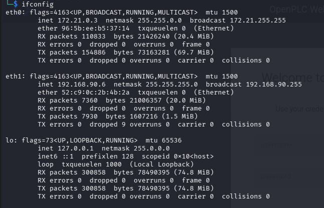
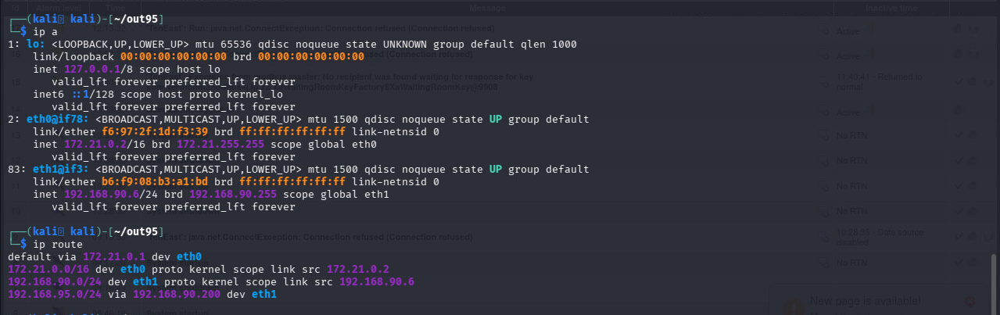

# Reconnaissance and Discovery

## 1. Network Identification

The first step is identifying which networks our attacking machine can reach.

*Figure 1: Kali interface configuration showing assigned IP address.*

*Figure 2: Routing table / network interfaces showing reachable subnets.*

**Findings:**
- Our Kali machine (`192.168.90.6`) resides on the `192.168.90.0/24` network.
- A second subnet, `192.168.95.0/24`, is reachable via the router at `192.168.90.200`, indicating this machine acts as a gateway/pivot point between the two networks.

---

## 2. Host Discovery

With the networks identified, we performed host discovery to enumerate live hosts on each subnet using `nmap`.

**Results:**
- [Active Hosts – 192.168.90.X](./192.168.90.X/ActiveHosts.txt)
- [Active Hosts – 192.168.95.X](./192.168.95.X/ActiveHosts.txt)

---

## 3. Port Scanning

For each live host, we identified open ports and then enumerated the services/versions running on them. This was done as a two-stage process: first finding open ports, then running targeted service/version scans against them.

### 3.1 Open Port Discovery

- [Open Ports – 192.168.90.X](./192.168.90.X/OpenPorts.txt)
- [Open Ports – 192.168.95.X](./192.168.95.X/OpenPorts.txt)

### 3.2 Service/Version Scans

Using the ports identified above, targeted scans were run to fingerprint services and versions running on them.

- [Service Scans – 192.168.90.X](./192.168.90.X/NmapScans/)
- [Service Scans – 192.168.95.X](./192.168.95.X/NmapScans/)

---

## 4. Modbus Banner Grabbing

Service scans revealed several hosts on `192.168.95.0/24` running Modbus, suggesting this subnet hosts ICS/SCADA or PLC devices. We used a Metasploit Modbus banner grabbing module to identify these Modbus devices.

**Results:**
- [Modbus Banner Grabbing Output](./modbusBannerGrab)

**Significance:** The presence of Modbus devices indicates an operational technology (OT) segment, which is a high-value target for further enumeration to map device roles and functions.